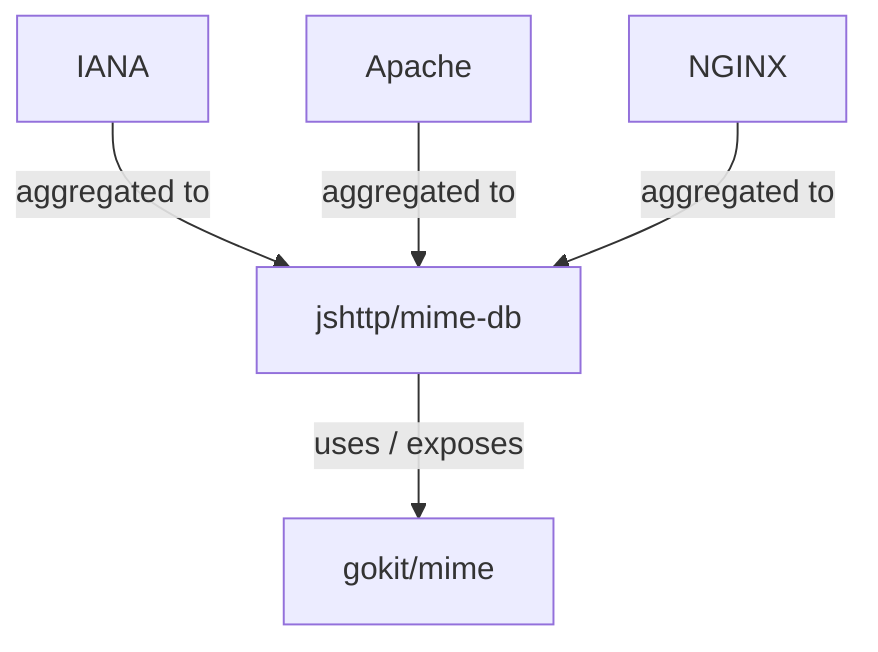

What
----

Static content-type ("MIME") database.


To update the database
----------------------

Run:

```console
$ go generate ./generator
```

This updates and code generates our `db.gen.go` from the source's head. Remember to
`$ go fmt` before committing.


Source of data
--------------



[See more](https://github.com/jshttp/mime-db)


Why?
----

### Go's stdlib

Go's built-in DB relies on OS to provide it. It works differently on Windows, Linux etc.

On Alpine Linux IIRC there isn't a package to supply the database, unless you install Apache or Nginx.


### Go's ecosystem

https://github.com/cubewise-code/go-mime

- TypeByExtension() doesn't have fallback
- there is no ExtensionByType()

https://github.com/gabriel-vasile/mimetype

- Based on magic numbers

https://github.com/h2non/filetype

- Based on magic numbers
